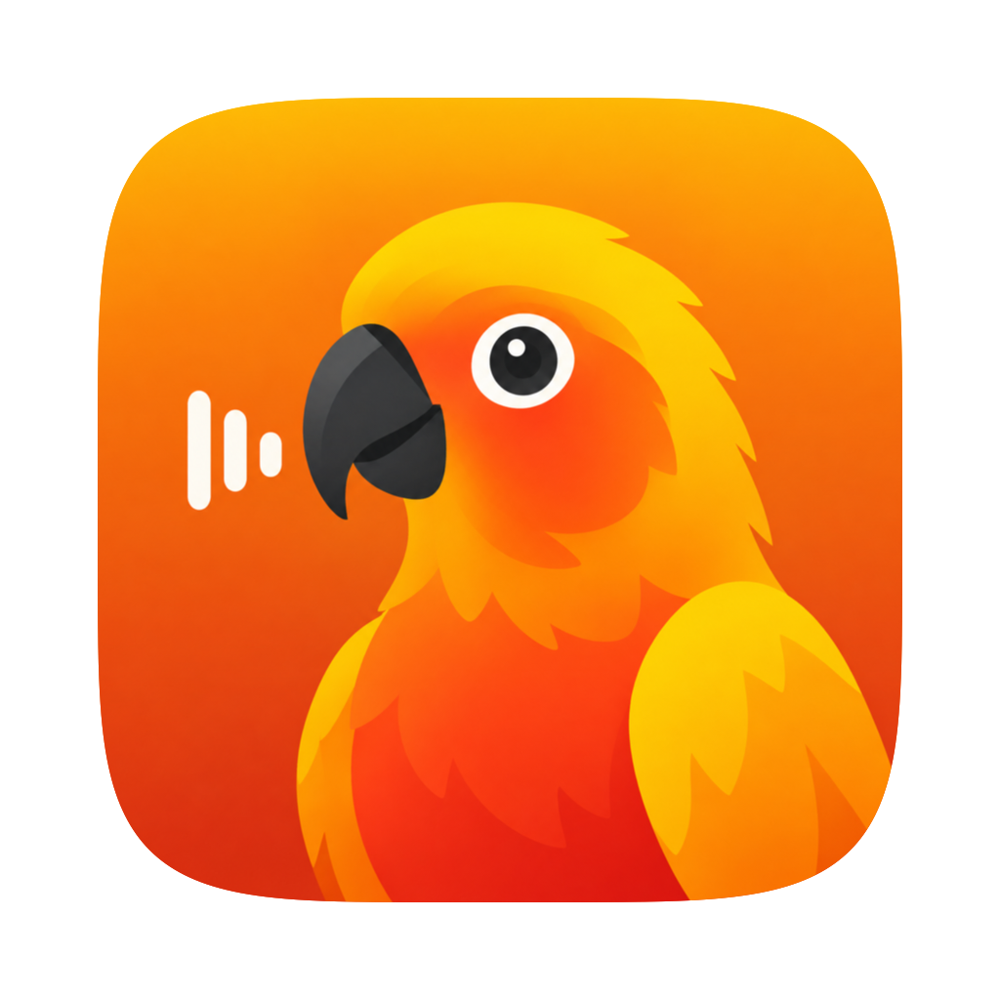

<p align="center">
  
</p>

<h1 align="center">Conure</h1>

<p align="center"><strong>Local-first audio &amp; video transcription for Apple Silicon Macs.</strong></p>

<p align="center">
  <a href="https://github.com/nethbotheju/Conure/actions/workflows/ci.yml"></a>
  <a href="https://github.com/nethbotheju/Conure/releases"></a>
  <a href="LICENSE"></a>
</p>

NVIDIA's Parakeet ASR running entirely on-device (CoreML / Neural Engine), with speaker diarization, a queue-driven GUI, and a scriptable CLI — one engine behind both.

## Features

- **Fully local:** audio never leaves your Mac, and everything works offline after the first model download.
- **Fast:** ~45–95× real-time on Apple Silicon — a 2-hour recording transcribes in ~2–3 minutes.
- **Lean:** ~1.7 GB peak memory, even for 2-hour files.
- **Speaker-aware:** name up to 4 attendees and every line comes out labeled with the right speaker.
- **App + CLI:** drop files into the queue app and watch live progress, or script the CLI with JSON output — one engine behind both.
- **Formats:** clean Markdown with optional timestamps, or ready-to-use SRT subtitles with speaker prefixes.

## Install

1. Download the latest `Conure-<version>.dmg` from [Releases](https://github.com/nethbotheju/Conure/releases).
2. Open the DMG and drag **Conure** to **Applications**.
3. First launch: right-click the app → **Open** (it's unsigned — see below), and the required models (~240 MB) download automatically.

> **Unsigned app note:** Conure ships without a Developer ID. If macOS blocks it, right-click → **Open**, or clear the quarantine flag manually:
> ```bash
> xattr -cr /Applications/Conure.app
> ```

**Requirements:** macOS 15+ on Apple Silicon (M1–M4). ~860 MB of model downloads on first use (auto-managed).

## Quick start

**App** — launch Conure, hit **＋**, drop in files (optionally name up to 4 speakers), and watch the queue run.

**CLI** — install the bundled engine on your PATH from Settings, or use it straight from a build:

```bash
# Plain transcript (Markdown, no timestamps) next to the input file
conure transcribe meeting.mp4

# Speaker-labeled Markdown with timestamps and attendee names
conure transcribe meeting.mp4 --speakers "Alice,Bob" --timed

# SRT subtitles with speaker prefixes
conure transcribe recording.m4a --speakers "Alice,Bob" --format srt

# Multiple files (processed sequentially), custom output folder
conure transcribe *.mp4 --speakers "Alice,Bob,Carol" --output ~/transcripts

# Progress as JSON lines (for tooling); --pretty for humans
conure transcribe talk.wav --pretty
```

| Flag | Default | Description |
|---|---|---|
| `--model` | `parakeet` | Model id or HuggingFace repo |
| `--speakers` | — | Comma-separated attendee names (max 4); enables diarization |
| `--format` | `md` | `md` or `srt` |
| `--timed / --no-timed` | no | Timestamps in Markdown output (`[H:MM:SS]` per line) |
| `--output` | input folder | Output directory |
| `--pretty` | JSON lines | Human-readable progress |

## Models

```bash
conure models list                 # registry, download status, sizes (also --json)
conure models download parakeet    # pre-download (~611 MB)
conure models remove parakeet      # free disk space
```

Models live in `~/Library/Application Support/Conure/models/` (override with `CONURE_MODELS_DIR`). Missing models download automatically on first use.

| Id | Purpose | Size | Removable |
|---|---|---|---|
| `parakeet` | ASR — Parakeet TDT 0.6B v2 English, CoreML INT8, Neural Engine (default) | ~611 MB | Yes |
| `sortformer` | Speaker diarization (≤4 speakers), used with `--speakers` | ~239 MB | No (required) |
| `silero` | Voice activity detection, used otherwise | ~1 MB | No (required) |

Only Parakeet models run on the all-CoreML engine today — other variants (multilingual, unified-EN) need CoreML conversions that don't exist in a compatible format yet.

## How it works

1. **Decode** — AVFoundation extracts mono 16 kHz PCM (mp4, mov, m4a, mp3, wav, aac, aiff)
2. **Segment** — with `--speakers`: Sortformer diarization produces speaker turns; otherwise Silero VAD finds utterances. Same-speaker turns merge into ≤25 s chunks
3. **Transcribe** — each chunk through Parakeet TDT (30 s CoreML windows); chunk bounds become line timestamps, so a line can never blend two speakers
4. **Write** — Markdown or SRT next to the input (or `--output` dir)

The GUI drives the exact CLI as a subprocess (JSON progress on stdout) — one engine everywhere. Internals and repo layout are documented in [AGENTS.md](AGENTS.md).

## Contributing

Pull requests are welcome.

1. Fork the repo and create a branch using `<type>/<issue>-<slug>` (e.g. `feat/42-add-export`).
2. Open a pull request against `main` describing the change.

Coding agents should follow [AGENTS.md](AGENTS.md) for project structure, conventions, and setup.

## Credits

- [speech-swift](https://github.com/soniqo/speech-swift) (Apache-2.0) © soniqo — the inference engine, vendored with a long-file fix at `vendor/speech-swift/`
- Parakeet TDT weights (CC-BY-4.0) © NVIDIA
- Sortformer © NVIDIA
- Silero VAD (MIT)

## License

Conure code is released under the [MIT License](LICENSE).
